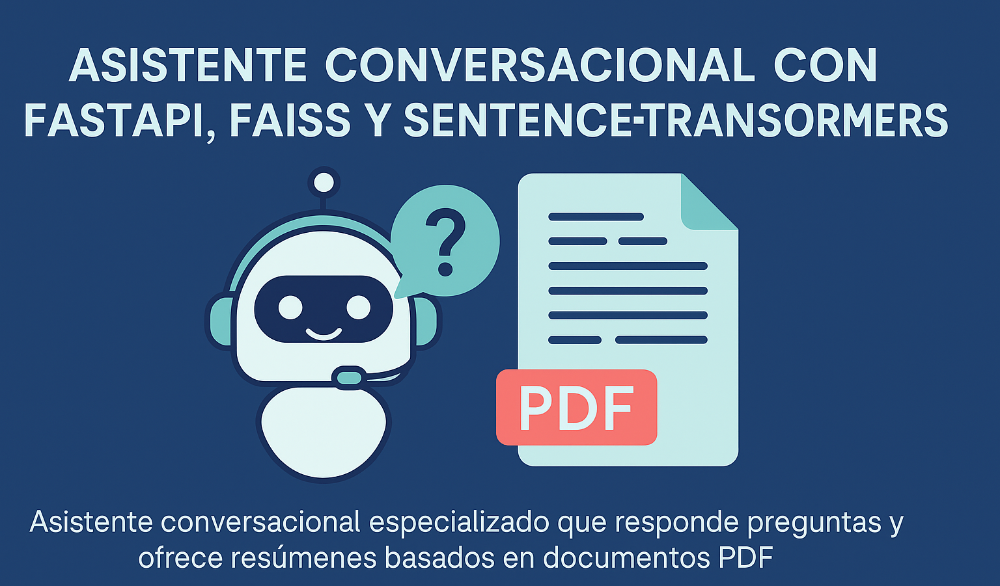

Este proyecto consiste en un **asistente conversacional especializado** que responde preguntas y ofrece resúmenes basados en documentos PDF, usando técnicas de **búsqueda semántica** y **modelos de lenguaje**.

Fue desarrollado como parte de mis proyectos personales de **Data Scientist, AI**, para seguir aprendiendo y reforzar mis conocimientos

---

## 🔗 Demo Local y Despliegue

Actualmente puedes ejecutar el asistente localmente o desplegarlo en servicios de nube como **Azure Containers** o **Render**, desde la propia consola en local usando las intrucciones del el archivo **Ejecutar**

---

## 📌 Objetivo del Proyecto

Crear un asistente que permita consultar información de grandes documentos (PDFs) mediante preguntas naturales, facilitando el acceso a conocimiento especializado y resúmenes automáticos.

---

## ⚙️ Proceso de Desarrollo

### 📄 Procesamiento y Preparación de Datos
- Extracción de texto de documentos PDF.
- División en fragmentos para búsqueda eficiente.
- Indexación con **FAISS** para búsqueda semántica rápida.

### 🧠 Modelo de Lenguaje
- Uso de **sentence-transformers** para embeddings semánticos.
- Búsqueda por similitud para identificar fragmentos relevantes.
- Generación de respuestas y resúmenes en base a contexto.

### 🛠️ API y Backend
- Creación de endpoints REST con **FastAPI**.
- Manejo de consultas, búsqueda y respuesta en tiempo real.
- Dockerización para despliegue sencillo y reproducible.

---

## 🧰 Tecnologías Utilizadas

- Python 🐍
- FastAPI 🚀
- FAISS (Facebook AI Similarity Search)
- sentence-transformers (Hugging Face)
- PyPDF2 (o similar) para extracción de texto PDF
- Docker para contenerización

---

## 🎯 Aplicaciones Reales

- Soporte a consultas en bases de conocimiento extensas.
- Asistentes para educación, soporte técnico y análisis documental.
- Herramientas de resumen automático y búsqueda avanzada.

---

## ✨ Conclusión

Este asistente muestra cómo integrar búsqueda semántica y modelos de lenguaje para construir soluciones prácticas que mejoran la interacción con información compleja y voluminosa.

---

📫 ¿Comentarios o sugerencias? ¡Estoy abierto a recibir feedback para mejorar este proyecto!
